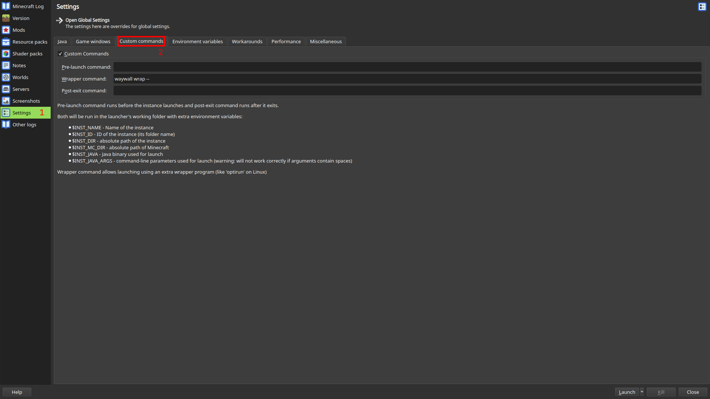

# Setup

After compiling waywall, you will need to configure your instance(s) to use it.
[Prism Launcher] is the best choice, although any variant of [MultiMC] should
work.

## GLFW

Minecraft uses a library known as [GLFW] in order to create a window and
receive keyboard and mouse input. Unfortunately, the version shipped by default
does not work with waywall, so you will need to compile a patched version of
GLFW.

You can compile the patched version of GLFW with the following commands:

```sh
# clone GLFW
git clone https://github.com/glfw/glfw
cd glfw
git checkout 3.4

# apply the patches
curl -o glfw.patch https://raw.githubusercontent.com/tesselslate/waywall/be3e018bb5f7c25610da73cc320233a26dfce948/contrib/glfw.patch
git apply glfw.patch

# compile GLFW
cmake -S . -B build -DBUILD_SHARED_LIBS=ON -DGLFW_BUILD_WAYLAND=ON
cd build
make
```

After running these commands, the new patched version of GLFW will be located at
`glfw/build/src/libglfw.so` (or `src/libglfw.so` from the `build` directory.)
You can copy it to a safer location like `~/.local/lib64`.

## Instance setup

First, configure your instance to use the patched version of GLFW by opening its
settings (with the `Edit` button on the right pane) and going to `Settings` ->
`Workarounds`. Then, enable `Native libraries` and `Use system installation of
GLFW`. Finally, enter the path to the patched `libglfw.so` you just compiled.


<div class="warning">

Make sure you configure the instance to use patched GLFW correctly! If the
instance still uses the default version of GLFW, waywall will not do anything
when the game launches, since the game will still be running under Xwayland.

</div>

<br/>

Next, you need to configure your instance to use waywall. Navigate to the
`Custom commands` submenu and enter `waywall wrap --` into the `Wrapper
command` textbox. If needed, change `waywall` to point to the waywall executable
you compiled earlier.



## Configuration

waywall will not start up without a configuration file. It will search for one
in `$XDG_CONFIG_HOME/waywall` (typically `~/.config/waywall/`). You can create
a file with the following contents at `~/.config/waywall/init.lua` as a starting
point:

```lua
local waywall = require("waywall")
local helpers = require("waywall.helpers")

local config = {
    input = {
        layout = "us",
        repeat_rate = 40,
        repeat_delay = 300,

        sensitivity = 1.0,
        confine_pointer = false,
    },
    theme = {
        background = "#303030ff",
    },
}

config.actions = {}

return config
```

## NVIDIA

If you use an NVIDIA GPU, you will also need to set the environment variable
`__GL_THREADED_OPTIMIZATIONS` to `0`. This can be done in the `Environment
variables` submenu.

This environment variable fixes a startup crash (`GLFW error 65544`) and also
ensures that preemptive navigation works correctly.

[Prism Launcher]: https://prismlauncher.org
[MultiMC]: https://multimc.org
[GLFW]: https://github.com/glfw/glfw
